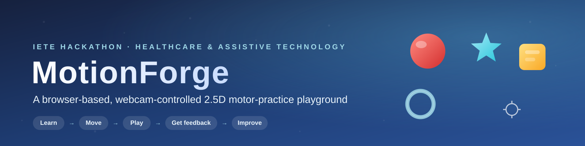
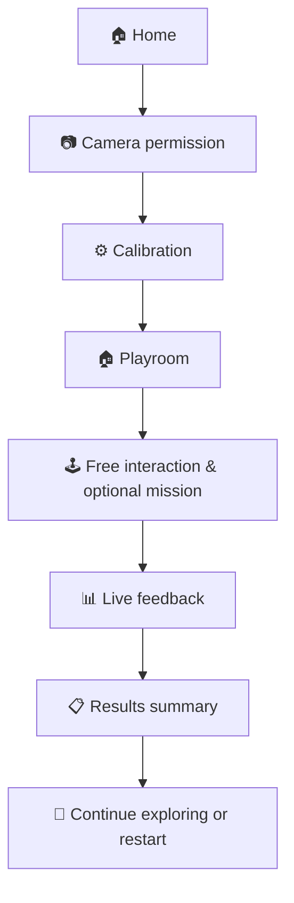
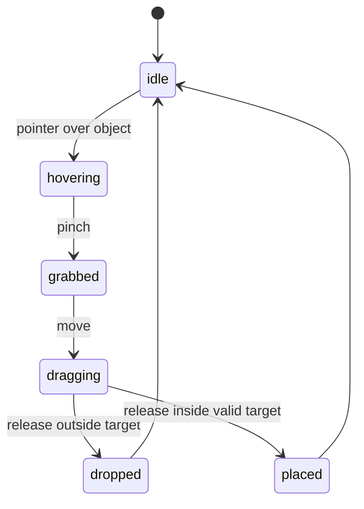
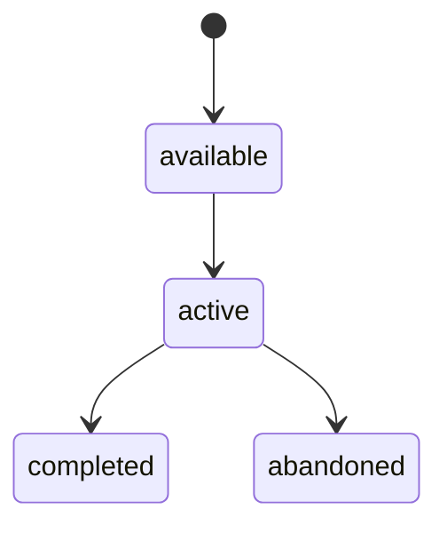

<p align="center">
  
</p>

<p align="center">
  <b>Move your hand. Grab virtual objects. Complete missions. Get real feedback.</b>
</p>

<p align="center">
  <a href="https://github.com/7bryan7/IETE-hack"></a>
  <a href="#"></a>
  <a href="#"></a>
  <a href="#"></a>
  <br/>
  
  
  
  
  
  
</p>

---

## Forest World extension

The existing Vite/React application now includes a separate, playable 3D Forest World. Choose **Explore Open Worlds** on Home, or open `/#worlds`; `/#forest` links directly to the forest intro. Four progressive levels cover two-hand navigation, crystal discovery, grab-and-place, and a magical-leaf quest. House World is Coming Soon. Classic missions remain accessible from the world menu.

The forest reuses the current webcam component and two-hand tracking hook, including handedness, coordinate mapping, smoothing, and pinch classification. Rendering uses React Three Fiber and Three.js; mouse/keyboard controls provide an explicit fallback. Completed forest levels persist separately from classic mission progress. This requested extension adds a compact 3D scene with fixed drag planes; the original MVP design below remains the reference for the classic experience.

See [Forest World controls, architecture, tests, and device checklist](src/forest/VALIDATION.md). Run `npm test`, `npm run build`, and `npm run test:forest` (installed Chrome required) to verify the change. Physical webcam sensitivity and deployed-device performance require a real-device check.

---

## ✨ What is MotionForge?

MotionForge is a **browser-based, webcam-controlled 2.5D motor-practice playground**. Users move a hand in front of a standard webcam to **select, grab, move, drop, and place** virtual objects while exploring an interactive scene and completing optional missions.

The hackathon prototype is intended to demonstrate **accessible, camera-driven interaction** and **transparent performance feedback**. It is *not* a diagnostic tool, a replacement for professional assessment, or a clinically validated treatment.

<div align="center">

### 🔄 **Core loop:** Learn → Move → Play → Get feedback → Improve

</div>

---

## 🏆 Hackathon Context

<div align="center">

| | |
|---|---|
| **👥 Team** | Bug Eaters |
| **🏥 Domain** | Healthcare and Assistive Technology |
| **🧩 Problem** | Motor coordination and movement planning |
| **💻 Solution type** | Browser software |
| **🎯 Project** | MotionForge |

</div>

---

## 🎯 Problem & Users

MotionForge is intended to help users practise activities involving:

<div align="center">

| 🎯 Skill | 📝 Description |
|---|---|
| 👁️ | Hand-eye coordination |
| 🎯 | Movement accuracy and control |
| 🔢 | Sequential actions |
| 🖐️ | Left/right-hand awareness |
| 🗺️ | Movement planning |

</div>

**Potential users** include children and adults with movement-related difficulties, including some autistic users, as well as **parents, teachers, and therapists** who support them.

> ⚠️ **Note:** The prototype only measures interaction performance inside MotionForge. Any future therapeutic claims, clinical thresholds, or claims of improved health outcomes would require domain-expert involvement and proper user studies.

---

## 🧠 Product Concept

Unlike a menu of disconnected mini-games, MotionForge provides **one persistent scene** containing several independently interactable objects. Missions give the user optional goals, but unrelated objects remain available for free exploration.

### 🏠 The First Environment — A 2.5D Playroom

<div align="center">

| 🧸 Object | 🎨 Description |
|---|---|
| ⚽ | Balls and blocks |
| 🧺 | A basket or box |
| 🗄️ | A shelf or target zone |
| ⭐ | Rings, stars, and buttons |

</div>

### 🕹️ Supported MVP Actions

<div align="center">

| Action | Description |
|---|---|
| 👆 **Hover** | Point at an object |
| ✋ **Touch** | Make contact with an object |
| 🤏 **Grab** | Pinch to pick up an object |
| 🖐️ **Move** | Drag the object around |
| 📥 **Drop** | Release the object |
| 🎯 **Place** | Put it inside a target zone |

</div>

> 🚫 **Post-MVP:** Throwing, stacking, physical collisions, pose-controlled movement, and multiple environments are post-MVP features.

---

## 🏗️ MVP Definition

A successful hackathon demonstration lets a judge:

<div align="center">

| # | Step |
|---|---|
| 1️⃣ | Open MotionForge in a supported desktop browser over HTTPS or localhost |
| 2️⃣ | Allow webcam access |
| 3️⃣ | Complete a short hand calibration |
| 4️⃣ | Enter the playroom and see several objects |
| 5️⃣ | Move a visible hand-controlled pointer |
| 6️⃣ | Hover over any supported object |
| 7️⃣ | Pinch to grab and move an object |
| 8️⃣ | Release to drop or place it |
| 9️⃣ | Complete the optional *"place the red ball in the basket"* mission |
| 🔟 | See live and final performance metrics |
| 1️⃣1️⃣ | Continue exploring or restart the mission without refreshing the page |

</div>

The MVP deliberately excludes **authentication, a backend, clinical scoring, full 3D depth control, realistic physics, and downloaded 3D asset pipelines**.

---

## 🧭 User Flow



> 💡 If the camera is unavailable or permission is denied, the app should explain the problem and provide **mouse input** as a demo and accessibility fallback.

---

## 🖱️ Interaction Model

### 📐 6.1 Coordinate System

The tracking adapter exposes normalized interaction coordinates:

- `x` and `y` are in the inclusive range `0..1`.
- The origin is the **top-left** of the visible interaction viewport.
- `x` increases to the **right** and `y` increases **downward**.
- Mirroring is performed once inside the tracking adapter because the webcam preview is mirrored.
- Rendering code converts normalized coordinates to viewport or world coordinates.
- Camera cropping and the interaction canvas must use the same aspect-ratio policy.

The 2.5D scene uses an **orthographic interaction plane**. Visual depth, shadows, layers, and simple 3D models may be used, but users are not required to control real-world depth with a monocular webcam.

### 🤏 6.2 Pointer & Grab Gesture

The pointer is derived from the **index fingertip**. If fingertip motion is too noisy on the demo hardware, the **palm centre** may be used as a configurable fallback.

A grab is a **thumb–index pinch**:

1. Calculate the distance between the thumb tip and index tip.
2. Divide it by a palm-size reference so the threshold is not dependent on distance from the camera.
3. Enter `pinching` when the normalized distance falls below the configured grab threshold.
4. Remain pinching until the distance rises above a larger release threshold.

> 🔧 Using separate grab and release thresholds provides **hysteresis** and prevents rapid state flicker. Thresholds are selected during device testing and may be adjusted during calibration.

### 🎯 6.3 Object Interaction States



**Rules:**

- Only a visible, grabbable object under the pointer may be grabbed.
- If objects overlap, select the **closest eligible object** according to a deterministic render/order rule.
- The selected object displays hover and grabbed feedback.
- A short tracking-loss grace period may preserve a grab for approximately **100–200 ms**.
- Longer tracking loss safely releases the object at its last valid position.
- Pointer motion is smoothed, but the raw sample remains available for debugging.
- Mission state never disables unrelated free interaction.

---

## 🔗 Shared Contracts

> These contracts are the integration boundary between tracking, world interaction, mission evaluation, and UI. **Changes require agreement from all three agents.**

```ts
type Handedness = "left" | "right" | "unknown";

type HandPointer = {
  handId: string;
  handedness: Handedness;
  x: number;
  y: number;
  rawX: number;
  rawY: number;
  pinch: boolean;
  pinchStrength: number;
  confidence: number;
  visible: boolean;
  timestampMs: number;
};

type WorldObject = {
  id: string;
  kind: "ball" | "block" | "basket" | "ring" | "star" | "button";
  position: { x: number; y: number; layer: number };
  size: { width: number; height: number };
  grabbable: boolean;
  movable: boolean;
  tags: string[];
  acceptsTags?: string[];
};

type InteractionAction =
  | "hover"
  | "touch"
  | "grab"
  | "move"
  | "drop"
  | "place";

type InteractionEvent = {
  eventId: string;
  sessionId: string;
  objectId: string;
  action: InteractionAction;
  position: { x: number; y: number };
  targetId?: string;
  handId?: string;
  timestampMs: number;
};

type MovementSample = {
  sampleId: string;
  sessionId: string;
  handId?: string;
  objectId?: string;
  x: number;
  y: number;
  pinch: boolean;
  trackingConfidence: number;
  timestampMs: number;
};

type TaskRecord = {
  taskId: string;
  sessionId: string;
  missionId: string;
  status: "completed" | "abandoned";
  startedAtMs: number;
  endedAtMs: number;
  finalSnapshot: PerformanceSnapshot;
};

type MissionStatus = "available" | "active" | "completed" | "abandoned";

type PerformanceSnapshot = {
  sessionId: string;
  missionId?: string;
  status: MissionStatus;
  elapsedMs: number;
  successfulRequiredActions: number;
  requiredActionAttempts: number;
  wrongObjectGrabs: number;
  failedDrops: number;
  totalErrors: number;
  pointerPath: number;
  directPath: number;
  movementEfficiency: number | null;
  trackingVisibleMs: number;
  sessionActiveMs: number;
  trackingAvailability: number;
  actionAccuracy: number | null;
  score: number | null;
  updatedAtMs: number;
};
```

> 📌 `actionAccuracy` is `null` until at least one required-action attempt exists. All percentages are clamped to `0..100`.

---

## 🎮 Missions & Continuous Performance Tracking

The MVP mission is **data-driven**: place the object tagged `red-ball` inside a target that accepts the tag `ball`.



The world emits interaction events. A separate **mission evaluator** consumes those events and updates the mission and performance state. *MediaPipe code must not update mission or UI state directly.*

### 📊 Required Metrics

MotionForge continuously updates and displays:

<div align="center">

| 📈 Metric | 🧮 Definition |
|---|---|
| ⏱️ Elapsed time | Time since mission start |
| ✅ Successful required actions | Actions completed correctly |
| 🔄 Required-action attempts | Total attempts |
| ❌ Wrong-object grabs | Grabbed the wrong object |
| 📥 Failed drops | Dropped outside the intended target |
| ⚠️ Total errors | Wrong-object grabs + failed drops |
| 🎯 Movement efficiency | Direct path / actual path |
| 📡 Tracking availability | Visible tracking time / active time |
| 🎯 Action accuracy | Successful / attempts |
| 🏁 Mission completion status | Available / active / completed |
| 🏆 Game score | Clearly labelled gameplay score |

</div>

**Definitions:**

```text
tracking availability = tracking visible time / active session time × 100

action accuracy = successful required actions / required-action attempts × 100

total errors = wrong-object grabs + failed drops

movement efficiency = direct start-to-target distance / actual pointer path × 100
```

A required-action attempt occurs when the user releases the required object, whether the release succeeds or fails. Free exploration with unrelated objects is logged but does not lower mission action accuracy, except that a wrong-object grab is reported separately.

Movement distances use normalized interaction coordinates so they remain independent of screen resolution. Movement efficiency is calculated only while the required object is held, is capped at 100, and remains `null` until a valid path and target exist. It is a **game-performance measure** rather than a clinical measure. *"Coordination"* is not reported as a separate score in the MVP because the current sensors and design do not define or validate it.

### 🏆 Game Score (Hackathon)

For the hackathon, the optional game score may be:

```text
completion points = 500 when completed, otherwise 0
accuracy points   = action accuracy × 3
time bonus        = max(0, 200 - floor(elapsed seconds × 2))
penalties         = wrong-object grabs × 20 + failed drops × 15

score = max(0, completion points + accuracy points + time bonus - penalties)
```

> 🎲 The score is a **gameplay reward**, not a medical or diagnostic measurement.

### 🔄 Continuous Tracking Behavior

- Create a session when the playroom opens.
- Update the snapshot at a limited UI frequency, such as **4–10 times per second**.
- Persist every semantic action accepted by the interaction engine, including hover, touch, grab, move, drop, and place events.
- Persist the movement samples used by the interaction engine at a controlled rate, such as **10–15 samples per second**, and whenever the pointer changes direction or crosses a meaningful distance threshold.
- Record every mission/task start, completion, abandonment, restart, and final performance snapshot.
- Pause active-time accumulation when the page is hidden or the session is paused.
- Finalize a snapshot on mission completion, restart, or exit.
- **Never store webcam frames or video.**

> 📝 *"Every movement"* means every movement sample consumed by the interaction and metric pipeline, not every raw webcam frame or MediaPipe landmark frame. This keeps the recorded path consistent with the metrics while avoiding unnecessary storage and main-thread work.

### 💾 Local Persistence — MVP

The working laptop is the **authoritative data store** for the MVP. Tracking and results must continue to work without a network connection.

- Use browser-local **IndexedDB** for sessions, movement samples, interaction events, task records, and performance snapshots.
- Use the `localStorage` API only for small values such as preferences, schema version, last active session ID, and recovery markers.
- Batch IndexedDB writes off the render loop so persistence does not reduce camera or scene frame rate.
- Flush pending records on mission completion, pause, restart, and page exit where the browser permits it.
- Assign stable UUIDs to sessions and records to support later synchronization without duplication.
- Retain a bounded configurable history and provide a clear local-data reset control.
- Recover an interrupted session from its latest saved snapshot when possible.

The results view may compare the current result with the previous equivalent task, personal best, and prior session history stored on the laptop. Comparisons must use the same mission, difficulty, calibration, metric schema, and application version.

### ☁️ Supabase Persistence — Post-MVP

Supabase is reserved for **post-MVP** storage, backup, cross-device history, and therapist/guardian dashboards. Local persistence remains available after Supabase is introduced.

The post-MVP synchronization layer should:

- Upload finalized sessions, task records, interaction events, movement samples, and performance snapshots in batches.
- Keep local records in an `unsynced`, `syncing`, `synced`, or `failed` state.
- Retry safely using stable record IDs and idempotent upserts.
- Resolve schema versions explicitly and never silently reinterpret older metrics.
- Obtain appropriate consent before associating records with an account or uploading them.
- Apply authentication, row-level security, data-retention rules, and least-privilege access.
- Sync metrics and event data only; **webcam images and video must never be uploaded**.

Supabase must be accessed through a **storage repository interface** rather than directly from tracking, interaction, mission, or UI components. This allows the MVP local repository and future Supabase repository to share the same application logic.

---

## ⚙️ Runtime Architecture

```mermaid
flowchart LR
    A[📷 Camera frame] --> B[🎯 MediaPipe tracking adapter]
    B --> C[📍 Landmarks]
    C --> D[🖐️ Pointer & pinch classifier]
    D --> E[⚙️ Calibration & smoothing]
    E --> F[✋ HandPointer]
    F --> G[🧩 Interaction engine]
    G --> H[🌍 World state + InteractionEvent]
    H --> I[🎮 Mission evaluator + performance accumulator]
    I --> J[💾 Local persistence repository]
    J --> K[📊 Live HUD + final results]
```



The same interaction engine must accept a **mouse pointer** so world development and testing do not depend on a working webcam.

---

## 🛠️ Technology Stack

### ✅ MVP

<div align="center">

| Layer | Technology |
|---|---|
| **Build** | ⚡ Vite |
| **UI** | ⚛️ React and TypeScript |
| **Tracking** | 🖐️ `@mediapipe/tasks-vision` Hand Landmarker |
| **Rendering** | 🎨 React Three Fiber (orthographic camera) or HTML Canvas |
| **State** | 🧠 React reducers; Zustand for shared cross-screen state |
| **Styling** | 🎀 Tailwind CSS or CSS Modules |
| **Logic tests** | 🧪 Vitest |
| **Browser tests** | 🎭 Playwright (when time permits) |
| **Local persistence** | 💾 IndexedDB + `localStorage` |
| **Deployment** | 🚀 Vercel, Netlify, or Cloudflare Pages |
| **Version control** | 🐙 Git and GitHub |

</div>

React Three Fiber is used for **presentation**, not for full free-depth interaction. Next.js, Supabase, Recharts, Rapier, and Pose Landmarker are intentionally excluded from the MVP unless the core vertical slice is already stable.

### 🚀 Post-MVP

- 🧱 **Rapier** for selected gravity, bounce, and collision interactions
- 🧍 **MediaPipe Pose Landmarker** for missions that require torso or shoulder movement
- ☁️ **Supabase** for cloud backup, cross-device history, and authorized dashboards
- 📈 **Recharts** for comparable multi-session trends
- 🎨 **Optimized GLB assets** for richer environments

---

## 📁 Suggested Project Structure

```text
src/
├── app/
│   ├── App.tsx
│   └── routes.tsx
├── components/
│   ├── calibration/
│   ├── camera/
│   ├── hud/
│   ├── playroom/
│   └── results/
├── core/
│   ├── contracts.ts
│   ├── interaction/
│   ├── missions/
│   └── performance/
├── tracking/
│   ├── mediapipe/
│   ├── calibration/
│   └── smoothing/
├── data/
│   ├── objects.ts
│   └── missions.ts
├── state/
├── storage/
│   ├── local/
│   └── repository.ts
├── test/
└── styles/

public/
└── assets/
```

---

## 🗺️ Implementation Flow

### 🏁 Milestone 0 — Scope & Contracts

- Scaffold Vite, React, and TypeScript.
- Add linting, formatting, and Vitest.
- Commit the shared contracts.
- Create a single deployed blank application.

### 🧪 Milestone 1 — Risk Spike

Prove this path on the actual demo laptop:

```text
webcam → fingertip marker → stable pinch → drag one rectangle
```

> ⚠️ **Do not start visual polish or physics before this succeeds.**

### 🏗️ Milestone 2 — Parallel Foundations

- **Agent 1** builds navigation, permission/calibration UX, HUD, results, and error states.
- **Agent 2** builds webcam lifecycle, MediaPipe, calibration, smoothing, pinch classification, and debug output.
- **Agent 3** builds the data-driven 2.5D playroom, mouse adapter, object state machine, and hit testing.

### 🔗 Milestone 3 — First Integration

- Connect `HandPointer` to the interaction engine.
- Emit `InteractionEvent` records.
- Complete grab, move, drop, and place behavior.
- Verify tracking-loss and restart behavior.

### 🎯 Milestone 4 — Mission & Metrics

- Add the red-ball mission.
- Accumulate and display live metrics.
- Finalize the results summary.
- Persist movement samples, interaction events, task records, and summaries in IndexedDB.
- Verify that history survives refresh and works offline.

### 🎤 Milestone 5 — Hardening & Presentation

- Test multiple lighting conditions and backgrounds.
- Test both hands, permission denial, camera loss, slow devices, and HTTPS deployment.
- Preserve the mouse fallback.
- Add visual and audio rewards only after reliability testing.
- Freeze features and rehearse the demo.

---

## 🛡️ Feasibility & Risk Controls

The MVP is feasible on a standard webcam-equipped laptop because inference and interaction remain browser-side and the world is limited to a single 2.5D scene.

<div align="center">

| ⚠️ Risk | 🛡️ Control |
|---|---|
| Poor lighting or background contrast | Calibration guidance and visible confidence/debug state |
| Noisy landmarks | Normalized pinch distance, hysteresis, and pointer smoothing |
| Temporary tracking loss | Short grace period followed by safe release |
| Inaccurate depth | Orthographic 2.5D interaction plane and large target zones |
| Low-end device performance | One-hand tracking, limited inference rate, lightweight scene |
| Camera privacy concerns | Local processing and no frame/video storage |
| Camera permission failure | Clear recovery instructions and mouse fallback |
| Late integration failure | Shared contracts, mock input, small frequent integrations |

</div>

---

## ✅ Definition of Done

The prototype is complete when the full MVP demonstration works reliably from the deployed URL on the demo laptop, the mission can be restarted without a refresh, the live and final metrics agree, detailed local history survives a refresh, offline recording works, and **no webcam frames leave the browser**.

> 🧱 **Implementation principle:** Build the interaction engine first; build visual richness around a proven interaction second.

---

<div align="center">

<br>

**Made with ❤️ by the Bug Eaters team** 🐛

*Healthcare & Assistive Technology · IETE Hackathon*

<br>

</div>
